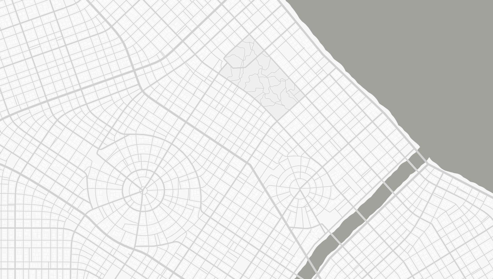

 

  <h3 align="center">City Map Generator</h3>

  

    Create procedural Fab City
     
     
     
    <a href="https://github.com/probabletrain/mapgenerator/issues">Report Bug</a>
    ·
    <a href="https://github.com/probabletrain/mapgenerator/issues">Request Feature</a>
     
    <a href="https://twitter.com/probabletrain">Twitter</a>
    ·
    <a href="https://ko-fi.com/probabletrain">Support the project</a>

  

<!-- TODO Changelog https://github.com/anikethsaha/docsify-plugin/tree/master/packages/docsify-changelog-plugin -->
<!-- TODO top announcement banner https://github.com/anikethsaha/docsify-plugin/tree/master/packages/docsify-top-banner-plugin -->

## About the project

- Create procedural maps
- Download the map as a `.png`
- Download a heightmap as a `.png`
- Download the map as a `.svg`
- Download the 3D model as a `.stl`

See the sidebar for instructions and details.

## Contact

Keir - [@probabletrain](https://twitter.com/probabletrain) - probabletrain@gmail.com 
Support the project: https://ko-fi.com/probabletrain 
[WebSite](https://maps.probabletrain.com/#/)

### STL and Heightmap Renders //*

### Maps

.png)
.png)
