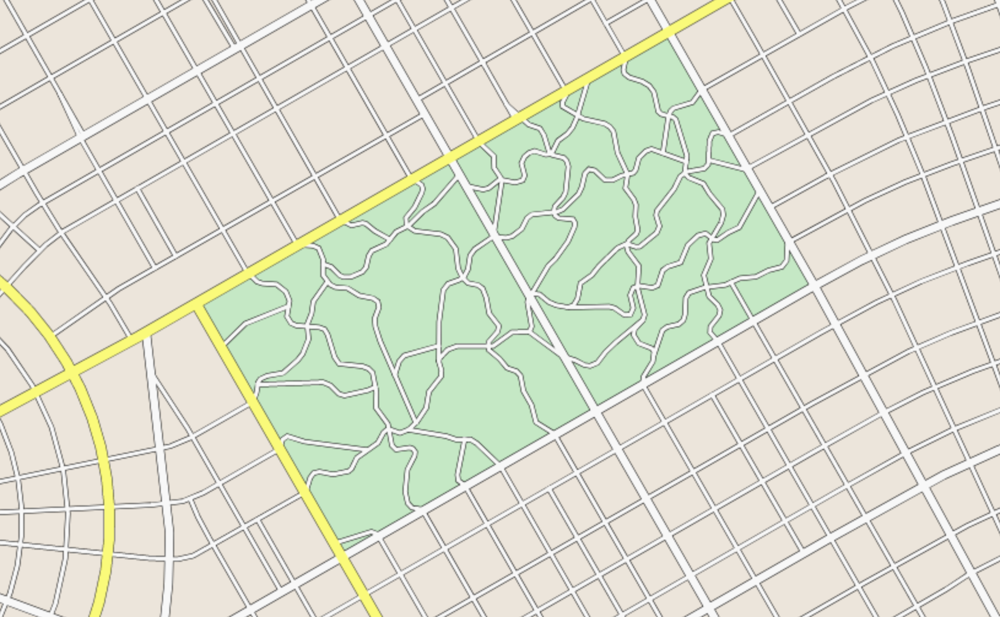
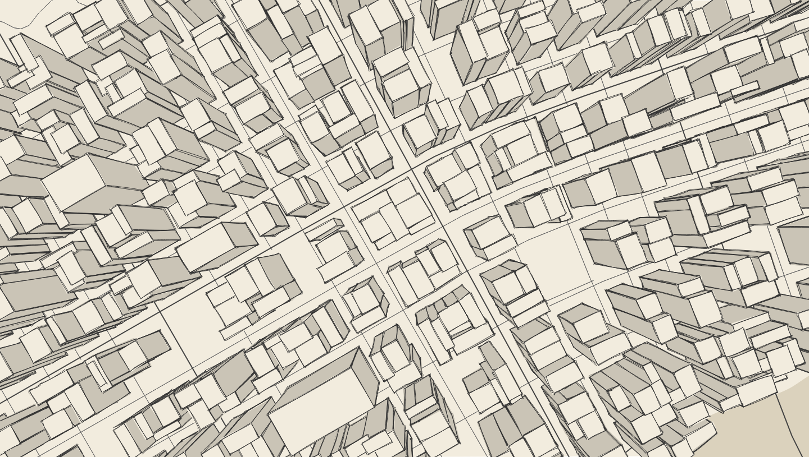
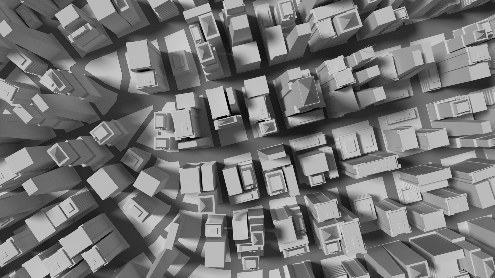

# Implementation Details

## High Level Overview

### Algorithm - Road Network

This generator is based on the paper '[Interactive Procedural Street Modeling](https://www.researchgate.net/publication/220183520_Interactive_Procedural_Street_Modeling)'. In general, code responsible for the generation algorithm lives in the `src/ts/impl` folder, whereas code responsible for putting it together and rendering it is under `src/ts/ui`.

| Grid | Radial | Combination | 
| :----------: |:------------:| :-----------:| 
| | Fields | |
|  |  |  |
| | Roads | |
|  |  |  |

#### Tensor Field

The tensor field in this case is essentially two vector fields which are perpendicular at any given point.

The tensor field used here associates a tensor with every point in 2D space. A tensor gives us two bidirectional, perpendicular vectors called the 'major' and 'minor' eigenvectors. Given a tensor (`src/ts/impl/tensor.ts`), we extract the two perpendicular vectors using the `getMajor` and `getMinor` methods.

A tensor field for the road network is created by smoothly combining grid and radial fields. See `src/ts/impl/basis_field.ts` for the representation of each basis field. `src/ts/impl/tensor_field.ts` is responsible for handling basis fields. It has a function `samplePoint`, which returns the tensor at that point in the field.

#### Streamlines

To create roads from the field, we integrate it, which is similar to tracing lines along the major and minor vector fields. Integrated lines are called streamlines, and the logic for handling streamlines is found in `src/ts/impl/streamlines.ts`. Integrators are found in `src/ts/impl/integrator.ts`, and RK4 is the integrator currently used. Given a starting point, we step in the direction of the major/minor vector by a distance `dstep` (configurable, found in the `road/params` folders in the GUI) using the `integrate` function in the integrator class. This process is repeated from the new point until a stopping condition is met e.g. reach the edge of the screen, hit an iteration limit, go around in a circle.

We make sure that streamlines are separated from each other by a configurable distance `dsep` (configurable in the GUI). `dsep` controls how dense the resultant road network is. `src/ts/impl/grid_storage` is responsible for enforcing this by making sure that any new point to be added to a streamline is `dsep` away from other streamlines.

#### Water

Water is generated before the roads, but since it is generated in the same way, its section is after. A single streamline is made through a noisy tensor field to generated the coastline and river. 2D Simplex noise is used to add rotational noise to the field. The rotation amount and noise 'zoom' is configurable in the UI. The noisy lines are simplified to create roads running along the coast and river. The intersection with between the roads and the boundary are calculated to create polygons for bodies of water. The tensor value when inside a body of water is 0 - it is a degenerate point. If a streamline hits a degenerate point, it stops.

?> **Tip** When I use the tool I generate water, and then I go back to the tensor field and add a few small basis fields. I make sure to preserve the tensors near the water boundaries, so that small roads still run parallel to water when generated. The extra fields help add interest and break up the grid when generating the rest of the roads (this sort of tensor field manipulation is a pain to do with the terrible UI, and will be improved).

#### Parks
Parks are generated the same was as building blocks are found - finding polygons in the graph. Large parks are created by finding polygons in the major road graph, before minor roads are generated. Rotational noise is added to the parks to make minor road paths through them more curvy. The user has an 'addParks' button in the UI that regenerates parks in the current road geometry. Big parks will be generated if minor roads are not there, otherwise, small parks are made.

| Simplex noise to rotate the tensor field |
| :----------: |
|  |

### Buildings

To add buildings we need to know the location and shape of building lots. We have a list of streamlines, where each streamline is a list of vectors. This is fine for drawing but challenging for logic - we don't know where the intersections are. To generate lots, we first need to build a logical graph of the road network consisting of nodes and edges.

#### Graph

* **Simplify-js** - To reduce the number of vectors in each streamline they are first simplified using `simplify-js` so that the intersection algorithm runs faster (This is a source of error - simplification potentially ruins T-junctions, TODO is modify/implement simplify-js so that it preserves such intersections. Currently the problem is hidden by extending roads by a small amount.)
* **isect** - Intersections are found in the streamlines using the `isect` library
* **Graph** - A graph is built. It is made up of nodes, where each node has a position vector and a set of neighbor nodes. This is done in `src/ts/impl/graph.ts`.
* **Polygon Finding** - Polygons are found in the graph using a simple algorithm: for each node, trace a path turning right at each intersection until you reach a visited node. This is done in `src/ts/impl/polygon_finder.ts` (This works if we assume no dead end roads. In reality we can't/shouldn't have to assume this so a better algorithm is TODO).
* **Polygons to buildings** - These polygons are first shrunk in size, and then divided by their longest edge recursively to create buildings. This stage is still an area of development.

| Intersections | Polygons | Building lots | 
| :----------: |:------------:| :-----------:| 
|  |  |  |

### Rendering

Everything is put together in `src/ts/ui/main_gui.ts` and drawn on the canvas.

**Classes**: When this project was started 3D buildings was out-of-scope, so everything is done on the HTML Canvas with no drawing library. `RoughJS` was later added to allow a hand-drawn style. In general, everything in `src/ts/impl/` uses world-coordinates, independent of screen pan or zoom. `src/ts/ui/domain_controller.ts` and `src/ts/ui/drag_controller.ts` handle keeping track of world space relative to screen space, and provide methods for transforming between them. Classes in `src/ts/ui` use these methods to convert geometry to screen space before passing them to `src/ts/ui/style.ts`. The geometry currently consists of polygons and polylines. `src/ts/ui/canvas_wrapper.ts` provides a very thin wrapper over the HTML and RoughJS canvas, to reduce the logic in `style.ts`. The `canvas_wrapper` also provides methods for creating an SVG file. `style.ts` takes a colour scheme, read from `colour_schemes.json`, and uses that to draw the scene.

**Update Loop**: The overall update loop for the application isn't very clean. The canvas is only redrawn when something changes - valid 'changes' have to be manually specified, see `main_gui.update()`. I've given the user the option to turn animation on or off, and to set the generation 'speed'. When animation is off, the generation runs until it is done. Since we only have one thread, the whole page freezes. When animation is on, we only run the generation algorithm for 30ms each frame. This value is configurable, and is called 'animationSpeed' in the UI. With animation on, the overall generation time is slower but the page is still interactable, and animation can be interrupted by clicking 'generate' again. 

**Pseudo-3D**: At some point I tried implementing 3D buildings more out of curiosity to see if it would work. Definitely a 'could I' rather than a 'should I' moment. 3D buildings are 'faked' on the 2D canvas rather naively. The geometry is calculated in `src/ts/ui/buildings.ts`, and passed all the way to `src/ts/ui/style.ts` which can decide what to do with it. Building geometry consists of `sides: Polygon[]` and a `roof: Polygon` (a `Polygon` is just a `Vector[]`). Rendering calculations are done on the CPU, naive, and slow. This is a big area for improvement, and what's implemented is more of a stopgap. Sides are drawn first, (for the RoughJS canvas, in order of distance to the camera). Then all the rooves are drawn, in order of height. This does mean that visual artefacts can easily be found when zoomed in (when a roof is below and behind a side).

For the normal HTML canvas, the building sides have no stroke style - there is no line separating the sides. This means we can (kind of) get away with not sorting the sides before drawing them. This helps pan+zoom performance when rending large numbers of buildings. For the RoughJS canvas, I loved having the drawn outlines of the sides, so sides are sorted by distance to the camera. When panning or zooming, the buildings aren't rendered. Camera position is configurable in the UI, and is most useful for choosing the direction of the orthographic projection. The camera height is calculated from the zoom.

| Pseudo-3D Buildings |
| :----------: |
|  |

**Future**: I currently do not plan to integrate Three.JS or any other 3D library into this project to properly create and render 3D buildings. I'm more tempted to create a separate application that takes city geometry and produces a 3D model, like Watabou's [CityViewer](https://watabou.itch.io/city-viewer). I would quite like to develop a shape grammar for the building generation.

| Here's one I made earlier |
| :----------: |
|  |

<!-- - roughjs
- colour schemes
- pseudo3d  -->

## Detailed Overview

> This section is under construction

<!-- #### Latex test:

$R \begin{pmatrix}
cos(2 \theta)&sin(2 \theta) \\ 
sin(2 \theta)&-cos(2 \theta)
\end{pmatrix}$ -->

<!-- https://upupming.site/docsify-katex/docs/#/supported -->