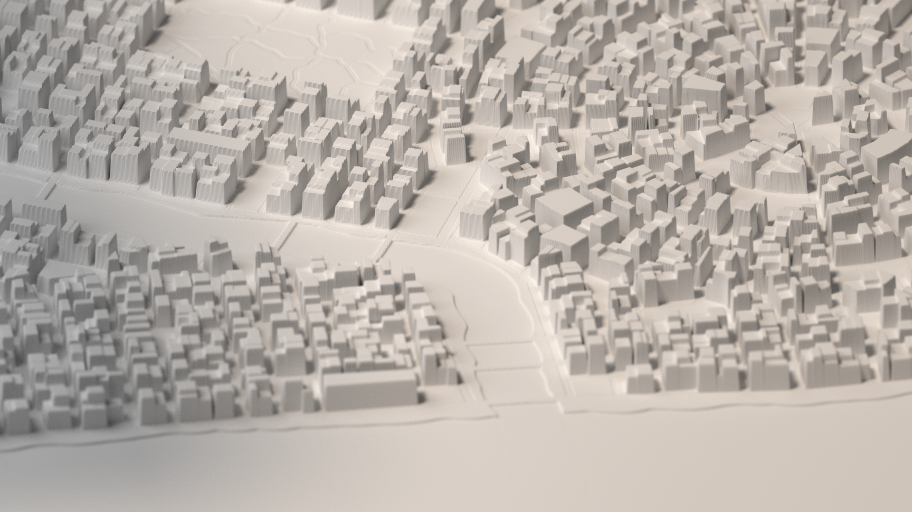

# Heightmap

To download a heightmap, click `Downlad -> Heightmap`. Alternatively, select the 'Heightmap' style from the Style folder, and download an image as usual.
The heightmap resolution is controlled relative to the canvas resolution by `imageScale`.

## Brief 3D Model Instructions

Here's a walkthrough of how I use heightmaps to create 3D models and renders of my cities.
I plan on implementing a `.obj` export feature which will be better-suited to this task. The height maps aren't ideal as they don't create rectangular geometry for the buildings. As you can see in the render, if the building is not aligned to the pixels, it has a jagged edge. This results in a lot of unecessary geometry that slows down rendering and geometry creation.

| Result |
| :----------: |
|  |

### Generate and download heightmap

| Heightmap | Map |
| :----------: | :----------: |
| .png) | .png) |

Click `Downlad -> Heightmap`.

?> **Tip** Higher heightmap resolution result in 'better' 3D models but they'll take longer to generate and render. I'm using an `imageScale` of 2 for this example.

### Create 3D model

I'm using Blender 2.79 for this example.
Follow [this tutorial](https://johnflower.org/tutorial/make-mountains-blender-heightmaps) to create the model. Some of my notes on the process are below.

- **Grid:** I created a grid with the same number of subdivisions as there are pixels in the depth map. I then scaled it so that it had the same aspect ratio as the depth map. For high-res depths maps this will run slowly, consider cropping the depth map/creating smaller geometry if you only want to render a specific portion of the city.
- **Displacement Modifier:** I use Strength: 0.1
- **Subsurface Modifier:** It's up to you whether or not to use this - it drastically affects performance if your plane has a lot of vertices. For my render, setting divisions to 2 took 9 minutes to compute before even starting rendering.
- **Camera:** I used an orthographic camera with aperture 8.0 to create the depth of field effect. I placed a cube in the scene and set that as the focus point for easier control over where the focus was. Make sure to hide the cube before rendering.
- **Lighting** For my example I used a sun lamp with strength 2.0

My render was done with imageScale 2, subsurf 2, and took 40 minutes on a Macbook pro.
