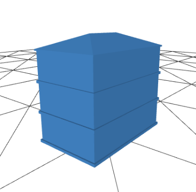

### 3D Buildings

##### .STL Files Generated with Blender v.2.82a
- [View](https://github.com/universalbit-dev/CityGenerator/blob/master/public/3D/buildings/building001.stl)

- [Building Tools](https://github.com/universalbit-dev/building_tools)
##### .GLB Files Generated with Blender v.2.82a      [Export scene as glTF2.0 file]

#### Some useful features are present in the ThreeJS editor
- [Threejs Editor](https://threejs.org/editor/)

- [Import .GLB]  

##### .JSON Files Generated with ThreeJS editor
- [Export Geometry]
- [Export Object]
- [Export Scene]

Threejs Editor:
- [Repository](https://github.com/mrdoob/three.js/tree/master/editor)

